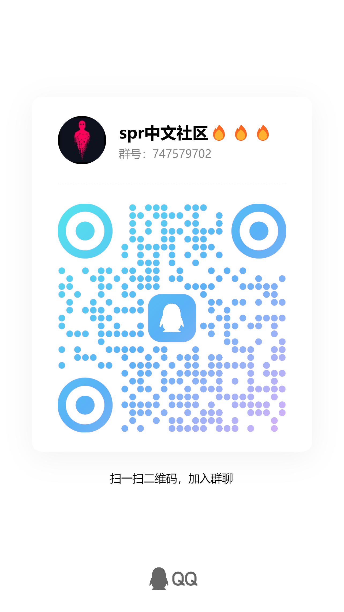

# README (English Version)

## spr All Information

Official Website: [Spectre Network: Fast, Private, Decentralized Blockchain (spectre-network.org)](https://spectre-network.org/)

Wallet: [Spectre Wallet (spectre-network.org)](https://wallet.spectre-network.org/)

Explorer: <https://explorer.spectre-network.org/>

Github: [Spectre (github.com)](https://github.com/spectre-project)

Twitter: <https://twitter.com/SpectreNetwrk>

Mining Reward Calculator: <https://spectre-network.org/#miningrewardcalculator>

## Nodes

### Windows Nodes

Run cmd scripts in the node folder:

- Step 1: Download repository: <https://gitee.com/muaimingjun/spectre-spr-information>
- Step 2: Download node files (can choose to overwrite data files in the node data directory): <https://spectre-network.org/downloads/legacy/datadir-rust.zip>
- Step 3: Enter the node folder and run the node script
- Step 4: Select a bridge and run the script

## Mining

- Hoe: [spr-hoe](https://github.com/itgpt/spectre-spr-information/releases/tag/v0.3.6)

**Please change your own bridge IP port number and your own wallet address in the file, according to the actual situation of your machine, change the number of threads, and your own mining machine name.**

## Exchanges

[Trade SPR with USDT : NonKYC cryptocurrency exchange](https://nonkyc.io/market/SPR_USDT)

[Exbitron](https://exbitron.com/trade?market=SPR-USDT)

# ♥️ Support Project

If <b>spectre-spr-information</b> has been helpful to you, please consider giving it a <b>Star</b> ⭐. Thank you for your support!

<table>
<thead>
<tr>
<th align="center">QQ Group 747579702</th>
<th align="center">Wallet</th>
</tr>
</thead>
<tbody><tr>
<td align="center"></td>
<td align="center"></td>
</tr>
</tbody>
</table>

If you wish, you can consider providing support to <b>spectre:qqsxlp2hpnpdzs3ur0sdjv6x479ywj92a0gfu6vlwahetz3n3mz2u8j3fwgwd</b> for additional support!

