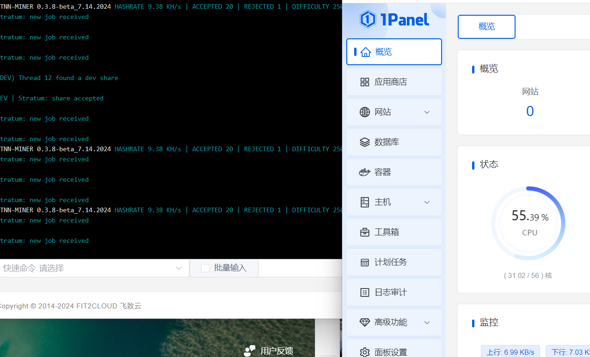
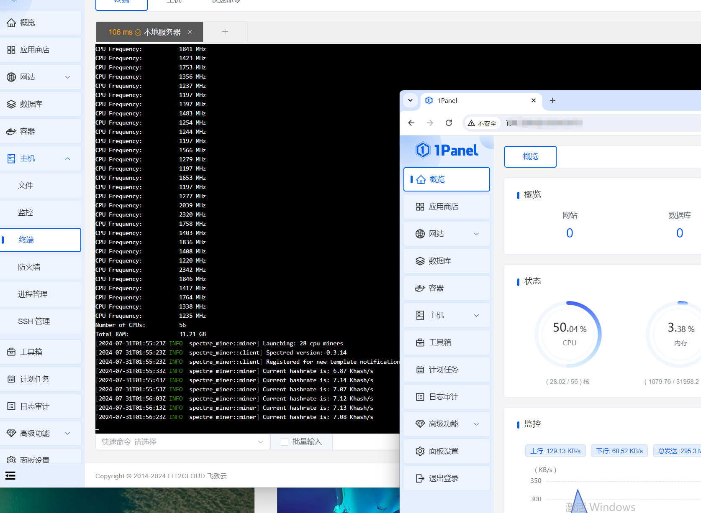

# spr 所有信息

官方网站：[Spectre Network: Fast, Private, Decentralized Blockchain (spectre-network.org)](https://spectre-network.org/)

web钱包（推荐）：[Spectre Wallet (spectre-network.org)](https://wallet.spectre-network.org/)

手机钱包: [Release v0.3.15 · spectre-project/spectre-mobile (github.com)](https://github.com/spectre-project/spectre-mobile/releases/tag/v0.3.15)

资源管理器：https://explorer.spectre-network.org/

github: [Spectre (github.com)](https://github.com/spectre-project)

twitter: https://twitter.com/SpectreNetwrk

收益计算器: https://spectre-network.org/#miningrewardcalculator

## 节点

### Windows节点

选择节点文件夹运行cmd脚本：

* 第一步下载仓库: https://gitee.com/muaimingjun/spectre-spr-information
* 第二步下载节点文件(可以选择覆盖掉节点data目录下面的数据文件)：https://spectre-network.org/downloads/legacy/datadir-rust.zip
* 第三步 进入node文件夹，选择节点运行脚本
* 第四步选择网桥 运行脚本

## 挖矿

这里推荐使用tnn锄头，因为算力确实增加很多

- 锄头：[spr-tnn-开发者2.5%](https://gitee.com/muaimingjun/spectre-spr-information/releases/tag/v0.3.6.1)
```bash
  tnn-miner* --spectre --daemon-address node-ip  --port  5555 --wallet spectre:qxxxxxxxxxg --threads 10 --worker-name 矿工名称
```
#### 算力




- 锄头：[spr-官方-社区税 1%](https://github.com/spectre-project/spectre-miner/releases/tag/v0.3.16)

```bash
  
./spectre-miner-v0.3.16-linux-gnu-amd64 --mining-address  spectre:xxxxxxx  -s x.x.x.x -p xxxx

  ```
#### 算力


  ​

**注意文件里面要更改自己的网桥ip端口号还有自己的钱包地址，根据自己机器实际情况更改线程数量，和自己矿机名称。**

## 交易所

[Trade SPR with USDT : NonKYCcryptocurrency exchange](https://nonkyc.io/market/SPR_USDT)

[Exbitron](https://exbitron.com/trade?market=SPR-USDT)

 


# ♥️ 支持项目\(Support\)

<p>如果 <b>spectre-spr-information</b> 对您有帮助，请考虑为它点个 <b>Star</b> ⭐，感谢您的支持！</p>
<table>
<thead>
<tr>
<th align="center">qq群 747579702 </th>
<th align="center">钱包</th>
</tr>
</thead>
<tbody><tr>
<td align="center"></td>

<td align="center"></td>
</tr>
</tbody>
</table>
<p>如果您愿意，可以考虑提供资助 <b>spectre:qqsxlp2hpnpdzs3ur0sdjv6x479ywj92a0gfu6vlwahetz3n3mz2u8j3fwgwd</b> 提供额外的支持！</p>

